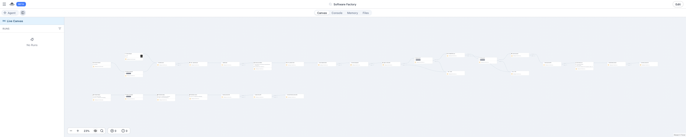
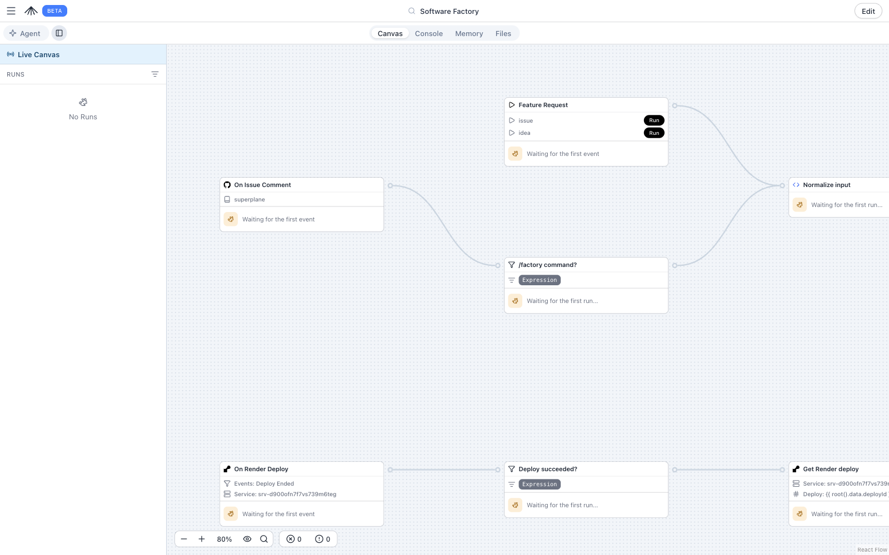
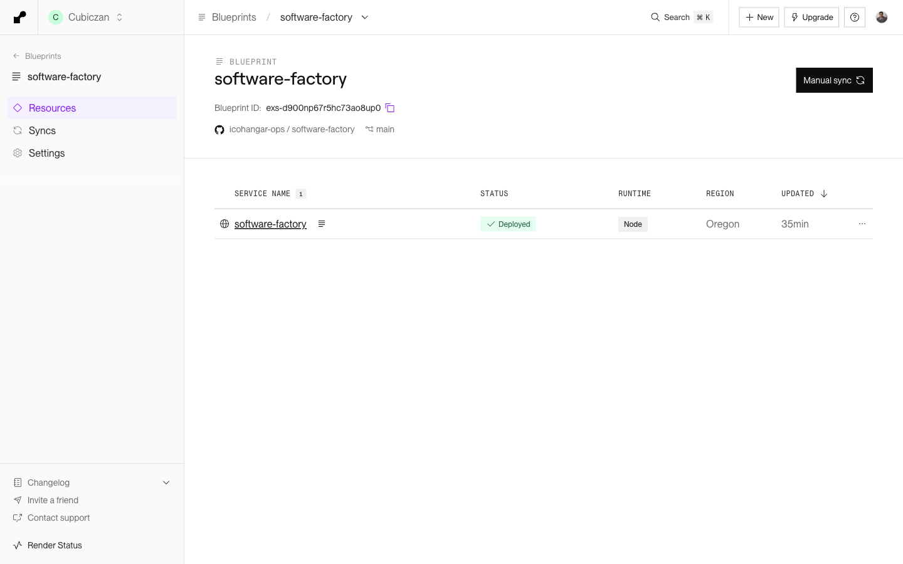
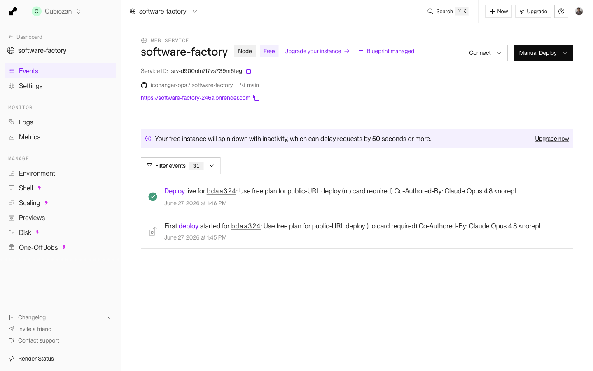
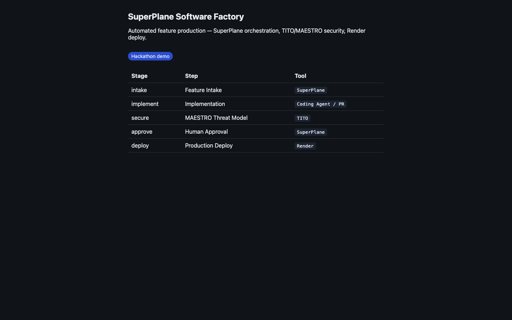

# SuperPlane Software Factory

**Hackathon theme:** [Build Your Own Software Factory](https://docs.google.com/document/d/151kAyQbpLdWKggWLMBPtjABEOaIN4h4gsBHOwthCN_s/edit) — turn a vague idea or GitHub issue into a working PoC overnight, with minimal human involvement.

An end-to-end **automated feature-production pipeline** orchestrated on [SuperPlane](https://docs.superplane.com/): a rough idea or GitHub issue goes in; an LLM specs it, a coding agent implements it in a sandbox, every stage validates the previous one, an **agentic-AI threat model (MAESTRO via TITO)** gates the change, and a working PoC ships to a [Render](https://dashboard.render.com/) preview — with the live URL posted back on the PR.

> **Live demo:** [software-factory-246a.onrender.com](https://software-factory-246a.onrender.com) · **Repo:** [icohangar-ops/software-factory](https://github.com/icohangar-ops/software-factory) · See **[HACKATHON.md](./HACKATHON.md)** for the demo script and judging alignment.

---

## What it does

```
Vague idea / GitHub issue #5368
        ↓
   LLM generates spec      →  validate spec
        ↓
   Daytona sandbox + LLM writes code  →  build / test gate
        ↓
   TITO · MAESTRO threat model  →  security gate  (critical = blocked)
        ↓
   PR opened → Render preview → live URL commented on the PR
```

Targets **[superplanehq/superplane](https://github.com/superplanehq/superplane)** — the five hackathon validation issues (#5368, #5366, #5164, #5704, #5705).

---

## Why MAESTRO (the differentiator)

A software factory that lets LLM agents **write and ship code autonomously** is itself an agentic-AI system — with all the novel attack surface that implies. Prompt injection becomes a code-execution path, tool access becomes lateral movement, and trust boundaries shift at runtime based on model behavior. Traditional SAST was never designed for this.

**MAESTRO** — *Multi-Agent Environment, Security, Threat, Risk, and Outcome* — is a **seven-layer reference framework for threat-modeling agentic AI**, introduced by Ken Huang via the Cloud Security Alliance. Instead of treating vulnerabilities in isolation, it decomposes an agentic system into seven layers and traces **cross-layer attack chains** — e.g. a Layer 1 prompt injection cascading through Layer 3 agent logic into a Layer 4 tool call — treating **trust-boundary validation between layers** as the primary control.

### The seven MAESTRO layers

| # | Layer | Representative agentic-AI threats |
|---|-------|-----------------------------------|
| 1 | **Foundation Models** | Prompt injection, jailbreaking, unsafe completions |
| 2 | **Data & Knowledge** | RAG poisoning, embedding / vector-store attacks |
| 3 | **Agent Frameworks** | Reasoning-loop abuse, framework (LangChain/CrewAI) exploits |
| 4 | **Tooling & Integration** | Tool poisoning, MCP-server attacks, unsafe tool dispatch |
| 5 | **Agent Communication** | Trust violations, message spoofing between agents |
| 6 | **Deployment & Infrastructure** | Container escape, resource exhaustion, secrets exposure |
| 7 | **Ecosystem & Governance** | Compliance gaps, accountability / provenance failures |

This factory's code-generation path most heavily exercises **Layers 1–4** — the LLM (1) drives an agent framework (3) that invokes tools (4) over generated artifacts (2) — so those are where the gate focuses.

> Reference: [Applying MAESTRO to Real-World Agentic AI Threat Models — From Framework to CI/CD Pipeline](https://cloudsecurityalliance.org/blog/2026/02/11/applying-maestro-to-real-world-agentic-ai-threat-models-from-framework-to-ci-cd-pipeline) (CSA).

### TITO — operationalizing MAESTRO in the pipeline

[**TITO**](https://github.com/Leathal1/TITO) (*Threat In, Threat Out*) is the scanner that turns MAESTRO from a framework into an automated gate. It reads source, discovers assets and data flows, and classifies findings across three lenses:

- **MAESTRO** — agentic-AI threats across the seven layers (`--maestro`)
- **STRIDE-LM** — classic STRIDE extended with Lateral Movement + Malware
- **MITRE ATT&CK** — every finding enriched with adversary techniques (`--mitre`)

It produces **attack-path narratives**, an interactive threat-model report, and SARIF for code-scanning. Critically, it supports **threat diffing** — comparing the threat model of a PR branch against its base so the gate surfaces only *newly introduced or materially changed* risk.

**How it gates this factory (two enforcement points):**

1. **In-pipeline (pre-PR):** the SuperPlane `TITO MAESTRO scan` node runs `tito scan --repo . --maestro --mitre` inside the Daytona sandbox **before any PR is opened**. Any critical agentic-AI finding fails the stage and the PR is never created.
2. **In CI (per-PR):** [`.github/workflows/tito-maestro.yml`](./.github/workflows/tito-maestro.yml) runs the [`Leathal1/TITO@v2`](https://github.com/Leathal1/TITO) action with `fail-on: critical`, posts a severity-table comment, publishes a `TITO Threat Model` commit status, and runs a **threat-diff** job (`fail-on: high`) that flags only what the PR changed.

```yaml
# .github/workflows/tito-maestro.yml (excerpt)
- uses: Leathal1/TITO@v2
  with:
    maestro: true
    mitre: true
    attack-paths: true
    sarif-output: true
    fail-on: critical
```

Run it locally against any repo: `./scripts/run-tito-local.sh .`

---

## Architecture

| Layer | Tool | Role |
|-------|------|------|
| Orchestration | [SuperPlane](https://docs.superplane.com/) | The full factory pipeline lives on the canvas |
| LLM | OpenAI integration | Spec + implementation generation |
| Execution | Daytona | Sandbox clone, code write, build verify |
| **Security** | **[TITO](https://github.com/Leathal1/TITO) + [MAESTRO](https://cloudsecurityalliance.org/blog/2026/02/11/applying-maestro-to-real-world-agentic-ai-threat-models-from-framework-to-ci-cd-pipeline)** | **Agentic-AI threat gate before any PR** |
| Preview hosting | [Render](https://dashboard.render.com/) | Live PoC / PR previews |

### The factory canvas (SuperPlane)



*The full pipeline — **28 nodes** across five stages: intake → spec → sandbox implementation → build gate → TITO/MAESTRO security gate → PR + Render preview. Each stage validates the previous one before proceeding (canvas reports **0 errors / 0 warnings**).*

<details>
<summary>Intake detail — triggers &amp; input normalization (click to expand)</summary>



</details>

### Deployed on Render





### Live PoC output



---

## Quick start

### 1. Install the SuperPlane CLI & build

Follow the official guide: **[docs.superplane.com/cli/overview](https://docs.superplane.com/cli/overview/)**.

```bash
curl -fsSL https://install.superplane.com/install.sh | sh
export PATH="$HOME/.local/bin:$PATH"

superplane connect https://app.superplane.com YOUR_API_TOKEN
superplane whoami
```

The app already exists in org **Cubiczan** (`Software Factory`, account `sam@cubiczan.com`). Push canvas + console changes with the helper (patches integration IDs from `params.json`, pushes a draft):

```bash
./scripts/push-superplane-draft.sh
# then publish the draft to live:
superplane apps canvas update -f superplane/canvas.yaml
```

### 2. Connect integrations

**Settings → Integrations** in SuperPlane, then copy the IDs into `superplane/params.json`:

| Integration | Purpose |
|-------------|---------|
| GitHub | Issues, PRs, preview comments |
| OpenAI | LLM spec + code steps |
| Daytona | Sandbox + build verify |
| Render | PR preview / deploy hosting |

```bash
superplane integrations list -o yaml
```

### 3. Deploy on Render

```bash
./scripts/setup-render.sh
```

1. [dashboard.render.com](https://dashboard.render.com/) → **New → Blueprint** → connect this repo (reads [`render.yaml`](./render.yaml))
2. **software-factory** service deploys; for PR previews use the **Previews → Manual** mode (`[render preview]` in the PR title)
3. SuperPlane → Integrations → **Render** (API key; webhooks auto-register — see [docs/RENDER_WEBHOOKS.md](./docs/RENDER_WEBHOOKS.md))

> **Render plan note:** `render.yaml` currently uses `plan: free` (no card required) — great for the demo, but the instance spins down when idle (~50s cold start) and Render PR previews require a GitHub-connected, paid (`starter`) service. Switch `plan: free` → `plan: starter` and add a payment method to enable always-on + automatic previews. *Render credits will be applied to this account.*

### 4. TITO locally (optional)

```bash
./scripts/run-tito-local.sh .   # writes threat-model.html
```

---

## Project layout

```
superplane/
  canvas.yaml              # The factory workflow (28 nodes) — install-param templates
  console.yaml             # Dashboard with validation issues
  params.json              # Repo + integration IDs + render_service_id
  validation-issues.json   # The 5 judging issues
.github/workflows/
  tito-maestro.yml         # CI MAESTRO gate + threat-diff on PRs
  render-preview.yml       # Posts the Render PR preview URL
assets/                    # README screenshots (full canvas, Render, live app)
docs/
  RENDER_WEBHOOKS.md       # Render → SuperPlane webhook wiring
render.yaml                # Render Blueprint
HACKATHON.md               # Theme checklist + demo script
```

---

## References

- [Hackathon brief — Build Your Own Software Factory](https://docs.google.com/document/d/151kAyQbpLdWKggWLMBPtjABEOaIN4h4gsBHOwthCN_s/edit)
- [SuperPlane CLI overview](https://docs.superplane.com/cli/overview/)
- [MAESTRO — Applying agentic-AI threat models to CI/CD (CSA)](https://cloudsecurityalliance.org/blog/2026/02/11/applying-maestro-to-real-world-agentic-ai-threat-models-from-framework-to-ci-cd-pipeline)
- [TITO — Threat In, Threat Out](https://github.com/Leathal1/TITO)
